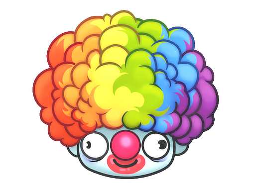

<p align="center">
  
</p>
<h1 align="center">CS2Cyclopedia API</h1>

<p align="center">
  API built with Angular 19 and Angular Material, providing access to information about cases, items, stickers, and much more related to the CS2 universe.
</p>
</br>
<h2 align="center">Technologies Used</h2>
<p align="center">
  This project was generated with <a href="https://github.com/angular/angular-cli">Angular CLI</a> version 19.
</p>

<p align="center">
  
  
  
   
  
</p>
</br>

<h2 align="center">How to Use</h2>
<h3 align="center">Installation:</h3>

<p align="center">
  To get started, make sure the following tools are installed on your machine:
</p>

1. Download and install Node from the official website:
   ```bash
   https://nodejs.org/

2. You can verify if Node.js is installed by running the following command in your terminal:
   ```bash
   node -v
   
3. Install Angular CLI via npm after installing Node.js:
   ```bash
   npm install -g @angular

4. Then, check if the CLI was installed successfully with:
    ```bash
    ng version

</br>

<h2 align="center">Running</h2>

1. Clone this repository:
   ```bash
   git clone https://github.com/Diagnoster/CS2Cyclopedia.git
2. Navigate to the project directory:
   ```bash
   cd repository
3. Install project dependencies:
   ```bash
   npm install
4. Start Angular Application:
    ```bash
    ng serve -o

</br>

# CS2 Price Service

### 🔎 Price Lookup

The application fetches item prices directly from the [counter-strike-price-tracker](https://github.com/ByMykel/counter-strike-price-tracker) repository, which maintains a [`latest.json`](https://raw.githubusercontent.com/ByMykel/counter-strike-price-tracker/main/static/prices/latest.json) file updated daily with the most recent prices for all tradable CS2 items.

To optimize performance and reduce server load:

- The file is fetched only once and cached in **memory** and **localStorage**.
- Subsequent requests reuse this cache without additional network calls.
- The service API (`Cs2PriceService`) provides methods to retrieve **all prices** or get the price of a **specific item** by its market hash name.

---

### 📌 Usage Example

```ts
import { Component, OnInit } from '@angular/core';
import { Cs2PriceService } from './services/cs2-price.service';

@Component({
  selector: 'app-root',
  template: `
    <div *ngIf="akPrice">
      AK-47 | Redline price: {{ akPrice }} €
    </div>
  `
})
export class AppComponent implements OnInit {
  akPrice: number | null = null;

  constructor(private priceService: Cs2PriceService) {}

  ngOnInit() {
    this.priceService.getItemPrice('AK-47 | Redline').subscribe(price => {
      this.akPrice = price;
    });
  }
}
```

<h2 align="center">Further Help</h2>

<p align="center">
  To get more help on the Angular CLI use <code>ng help</code> or go check out the
  <a href="https://angular.dev/tools/cli">Angular CLI Overview and Command Reference</a> page.
</p>

<h4 align="center">
  <a href="https://material.angular.io/components/categories">Angular Material Components</a>
</h4>

<br/>

<h2 align="center">Credits</h2>

<h4 align="center">
  Credits to ByMykel for providing the API for data retrieval: 
  <a href="https://github.com/ByMykel/CSGO-API">https://github.com/ByMykel/CSGO-API</a>
</h4>

<br/>

<h2 align="center">About</h2>

<p align="center">
  This software is 100% free, open-source and unlicensed.
</p>
